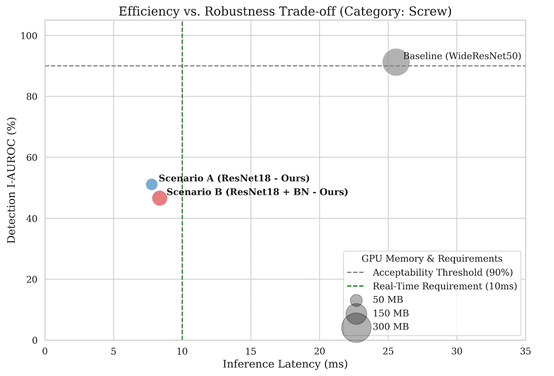
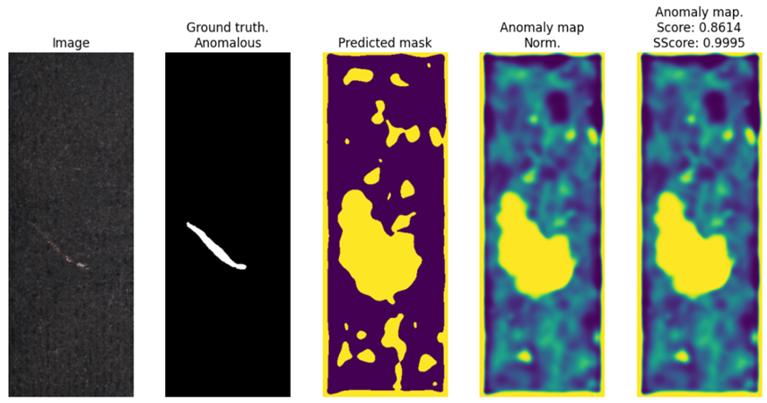

# SuperSimpleNet-Evolved: Industrial Anomaly Detection

> **Advanced Optimization & Weakly-Supervised Learning for Industrial Inspection** > *Academic Project - Machine & Deep Learning Course (2025-2026)*

## Overview

**SuperSimpleNet-Evolved** is a fork of the state-of-the-art [SuperSimpleNet](https://github.com/blaz-r/SuperSimpleNet) architecture. This project investigates the trade-offs between computational efficiency and detection robustness in industrial settings.

The goal was to transform a research model into an **Edge-ready** solution while reducing the dependency on expensive pixel-wise annotations.

### Project Documentation
You can find the detailed analysis and source files in the `docs/` directory:

- 📄 **Full Technical Report:** [Relazione_Progetto_ML_&_DL_ZAPPIA_GIUSEPPE .pdf](docs/Relazione_Progetto_ML_&_DL_ZAPPIA_GIUSEPPE%20.pdf)
- 📊 **Presentation Slides:** [Presentazione_ML&DL.pdf](docs/Presentazione_ML&DL.pdf)
- 🧪 **Experiments Notebook:** [progetto-ml-dl-zappia-giuseppe.ipynb](docs/progetto-ml-dl-zappia-giuseppe.ipynb)

---

## Key Contributions & Innovations

This repository introduces three major architectural evolutions derived from extensive experimentation on **MVTec-AD** and **KSDD2** datasets.

### 1. Efficiency Optimization (Edge Computing Focus)
Replaced the heavy `WideResNet50` backbone with a lightweight `ResNet18` to test limits on resource-constrained devices (simulated on NVIDIA Tesla P100).

* **Objective:** Reduce latency for real-time manufacturing lines.
* **Result:**
    * 📉 **-80% GPU Memory Usage** (Dropped from ~270MB to **52MB**).
    * 🚀 **4x Higher Throughput** (Increased from ~96 img/s to **~400 img/s**).
    * ✅ **100% I-AUROC** maintained on structural objects (e.g., *Bottle*).

### 2. Learned Noise Generator (Adversarial Training)
Identified a critical "Backbone Dependency" failure where lightweight models failed on complex textures (e.g., *Screw*), dropping to random guessing (~50% AUROC).

* **Solution:** Implemented a **GAN-style Learned Noise Generator** that dynamically learns optimal perturbations instead of using static Gaussian noise.
* **Technique:** Used `tanh` activation constraints and stochastic latent vectors ($z$) to stabilize training.
* **Outcome:** Successfully recovered detection capabilities on complex textures.

### 3. Weakly-Supervised Learning (GAP + CAM)
Addressed the high cost of industrial data annotation by enabling the model to train using **only image-level labels** (Good/Bad), removing the need for pixel-wise masks.

* **Implementation:** Replaced the Segmentation Head with **Global Average Pooling (GAP)** and **Class Activation Mapping (CAM)**.
* **Performance (KSDD2 Dataset):**
    * **98.6% I-AUROC** (Detection Accuracy).
    * This matches fully-supervised performance while requiring **zero** defect mask annotations.

---

## 📊 Experimental Results

### Efficiency vs. Robustness Benchmark
*Hardware: NVIDIA Tesla P100*

| Configuration | Backbone | Inference Time | GPU Memory | Bottle I-AUROC | Screw I-AUROC |
| :--- | :--- | :--- | :--- | :--- | :--- |
| **Baseline** | WideResNet50 | 25.58 ms | 270.5 MB | **100%** | **91.2%** |
| **Scenario A (Ours)** | **ResNet18** | **7.78 ms** | **52.4 MB** | **100%** | 51.1% (Fail) |
| **Scenario B (Ours)** | ResNet18 + Non-Lin | 8.36 ms | 85.9 MB | N/A | 46.6% (Fail) |

*(Note: While ResNet18 offers massive speed gains, it requires the Learned Noise Generator (Contribution #2) to handle complex textures like Screws effectively.)*

### Weakly-Supervised Performance (No Masks)
*Dataset: KSDD2 - Comparisons with state-of-the-art*.

| Method | Supervision Regime | AP-det (Detection) | Annotation Cost |
| :--- | :--- | :--- | :--- |
| SimpleNet | Unsupervised | 88.4% | None |
| SuperSimpleNet (Original) | Fully-Supervised | 97.4% | High (Pixel Masks) |
| **Ours (GAP+CAM)** | **Weakly-Supervised** | **94.5%** | **Low (Image Labels)** |

> **Insight:** Our Weakly-Supervised approach bridges the gap with fully supervised methods, achieving nearly identical detection performance (-2.9%) without the expensive labeling process.

---

## 🖼️ Visualizations

*(Screenshots from the analysis report)*

| **Trade-off Analysis** | **Weakly-Supervised Localization** |
|:---:|:---:|
| *Efficiency vs Robustness on Screw category* | *CAM Activation on KSDD2 Defect* |
|  |  |
| *ResNet18 provides massive speedup but requires learned noise for complex textures.* | *Model correctly identifies defect location (yellow blob) using only image labels.* |

*(Note: Please refer to Figures 6 and 19 in the [PDF Report](docs/Relazione_Progetto_ML_&_DL_ZAPPIA_GIUSEPPE%20.pdf) for high-resolution charts.)*

---

## 📜 Credits

This project is based on the paper:
*Rolih et al., "SuperSimpleNet: Unifying Unsupervised and Supervised Learning...", ICPR 2024.*

Original Repository: [SuperSimpleNet](https://github.com/blaz-r/SuperSimpleNet)

**Author:** Giuseppe Zappia
**University:** Università della Calabria
